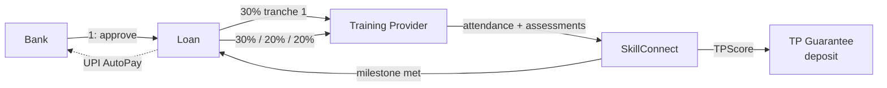

<div align="center">

# SkillConnect JK

**A public-private partnership platform providing outcome-linked skilling credit to youth in Jammu & Kashmir.**

<br/>


</div>

---

## TL;DR

A financing rail that lets banks fund skilling **without government subsidies** by engineering accountability into the product:

- **Milestone-based disbursement** — tranches of 30% / 30% / 20% / 20%
- **Dynamic Training-Provider guarantees** — sized from a live **TPScore**
- **UPI AutoPay** repayments
- **Risk-based pricing** via a 0–100 **Borrower Score**

Built for the Jammu Policy Hackathon.

---

## Architecture

```
skillconnect-jk/
├── apps/
│   ├── backend/          NestJS API server
│   └── frontend/         Next.js web application
├── packages/
│   └── shared/           Shared types + utilities
└── docker/               Docker configurations
```

### Stack

**Backend** — NestJS · TypeScript · PostgreSQL (TypeORM) · Redis · Bull queue · JWT (Passport)
**Frontend** — Next.js 14 · TypeScript · Tailwind + shadcn/ui · React Query + Zustand · next-intl (EN/HI/UR/KS)

---

## Features by persona

### 🎓 Learners (18–29)
- Browse accredited courses (IT/ITeS · Electronics · Tourism/Hospitality)
- Apply for skill loans ₹5,000 – ₹1,50,000
- Track learning progress and loan status
- Automated EMI payments via UPI AutoPay

### 🏫 Training providers
- Manage courses and batches
- Upload attendance and assessment data
- Track milestone disbursements
- View guarantee deposit status

### 🏦 Banks
- Review loan applications
- Monitor portfolio performance
- Process disbursements
- Manage collections

### 🛠️ Administrators
- Accredit training providers
- Configure policies and parameters
- Monitor system KPIs
- Generate reports

---

## Money flow



---

## Quick start

**Prereqs** — Node ≥ 18 · PostgreSQL ≥ 14 · Redis ≥ 7 · pnpm (recommended)

```bash
cd skillconnect-jk
pnpm install

# Backend
cd apps/backend
cp .env.example .env
pnpm dev

# Frontend (separate terminal)
cd apps/frontend
cp .env.example .env
pnpm dev
```

---

<div align="center">
<sub>Policy hackathon submission · Part of <a href="https://github.com/pbathuri">@pbathuri</a>'s <a href="https://github.com/pbathuri/Map_Projects_MAC">project portfolio</a></sub>
</div>
