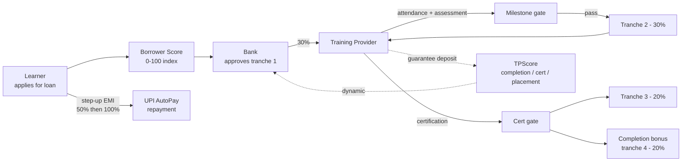

<div align="center">

# SkillConnect JK

**Outcome-linked skilling credit for youth in Jammu & Kashmir. Banks finance vocational training without government subsidy because every disbursement is gated on real progress.**

<br/>


</div>

---

## The problem

Three actors, three blockers:

- **Learners (18-29)** in J&K want vocational training but cannot pay course fees up front.
- **Training providers** want enrolments but lack accountability mechanisms that justify trust.
- **Banks** see skill loans as defaultable: no collateral, weak credit history, opaque outcomes.

Subsidy programs paper over these blockers but are fiscally unsustainable. SkillConnect JK rewires the incentives so the loan economics work without government underwrite.

---

## How it works



Four design choices do most of the work:

1. **Milestone-based disbursements (30 / 30 / 20 / 20)** - banks release the next tranche only when the previous milestone is verified.
2. **Training Provider guarantee deposits** - dynamically sized by **TPScore** (30% completion rate + 25% certification rate + 20% placement rate). Bad providers post bigger collateral.
3. **Borrower Score (0-100)** - identity, education, income, course fit, commitment, community endorsement. Replaces missing credit history.
4. **UPI AutoPay step-up EMI** - 50% of the EMI for the first six months while income stabilises, then 100%. Reduces early-default risk.

---

## What's in the repo

| Path | Stack | Purpose |
|------|-------|---------|
| `apps/backend/` | NestJS + TypeORM | API, auth, loans, milestones, TPScore, Bull queues, Swagger docs |
| `apps/frontend/` | Next.js 14 + Tailwind + shadcn/ui | Learner / TP / Bank / Admin portals, React Query, next-intl (EN/HI/UR/KS) |
| `apps/backend/src/modules/` | - | `auth`, `loans`, `risk-scoring`, `training-providers`, `banks`, `courses`, `notifications`, `admin` |
| `docker-compose.yml` | Postgres + Redis | Local dev orchestration |
| `Submission_documents/` | PDFs | Hackathon submission - PRD, architecture, security checklist, UX spec, ops playbook, risk policy, multi-bank expansion |

---

## Quick start

```bash
# Prereqs: Node 20+, Docker
npm install
docker compose up -d                    # Postgres + Redis
npm run db:migrate && npm run db:seed
npm run dev
# Frontend: http://localhost:3000
# Backend:  http://localhost:4000/api/v1   (Swagger at /api/docs)
```

Default seeded users land in `apps/backend/scripts/seed.ts` - one of each role (learner, TP, bank, admin) so you can walk every flow without registration.

---

## User flows at a glance

**Learner** - browse accredited courses (IT/ITeS, Electronics, Tourism/Hospitality), apply for ₹5K-₹1.5L loans, track milestones, see EMI schedule, repay via UPI AutoPay.

**Training Provider** - publish courses, enrol batches, upload attendance + assessments, monitor TPScore, watch milestone payouts hit the dashboard.

**Bank** - approve loans against Borrower Score, monitor portfolio KPIs, process collections, view TP exposure.

**Admin (J&K govt)** - accredit training providers, configure risk policies and pricing, generate compliance reports.

---

## Submission context

Built as a J&K Policy Hackathon submission. The repo ships with the full submission packet under [`Submission_documents/`](./Submission_documents/):

- Product Requirements Document
- Backend Architecture & Tech Stack
- Application Flow Document
- Design & UX Specification
- Risk & Credit Policy Appendix
- Security & Compliance Checklist
- Pilot Operations Playbook
- Multi-Bank Aggregator Expansion Proposal

The PDFs reference back to the modules in `apps/backend/src/modules/` so reviewers can verify each policy claim against working code.

---

## License

Proprietary to the Government of Jammu & Kashmir for the duration of the hackathon. Code authored by [@pbathuri](https://github.com/pbathuri); contributions and queries welcome.

---

<div align="center">
<sub>Part of <a href="https://github.com/pbathuri">@pbathuri</a>'s <a href="https://github.com/pbathuri/Map_Projects_MAC">project portfolio</a> - public-sector fintech.</sub>
</div>
